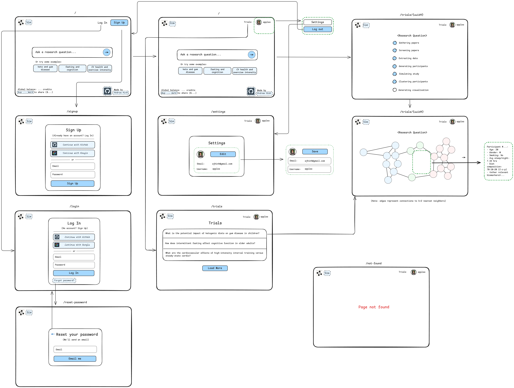

# sim

Directed interventional in-silico simulations



## Development

### Set Up

Set up the environment:

```bash
uv sync --all-extras --dev
uv run pre-commit install
modal setup
modal config set-environment dev
echo "alias modal='uv run modal'" >> ~/.bashrc
echo "export PYTHONPATH=.:$PYTHONPATH" >> ~/.bashrc
echo "export TOKENIZERS_PARALLELISM=false" >> ~/.bashrc
echo "export HF_HUB_ENABLE_HF_TRANSFER=1" >> ~/.bashrc
source ~/.bashrc
```

Create a `.env` (+ `.env.dev`):

```bash
HF_TOKEN=

POSTGRES_URL=
POSTGRES_PRISMA_URL=
SUPABASE_URL=
NEXT_PUBLIC_SUPABASE_URL=
POSTGRES_URL_NON_POOLING=
SUPABASE_JWT_SECRET=
POSTGRES_USER=
NEXT_PUBLIC_SUPABASE_ANON_KEY=
POSTGRES_PASSWORD=
POSTGRES_DATABASE=
SUPABASE_SERVICE_ROLE_KEY=
POSTGRES_HOST=
SUPABASE_ANON_KEY=

STRIPE_PUBLISHABLE_KEY=
STRIPE_SECRET_KEY=
STRIPE_WEBHOOK_SECRET=
DOMAIN=
```

### Useful Tips

Migrate db (do before running the frontend/api):

```bash
export ENV={env}
export MSG={message}
uv run alembic -x env=$(ENV) -c db/migrations/alembic.ini stamp head
uv run alembic -x env=$(ENV) -c db/migrations/alembic.ini revision --autogenerate -m "$(MSG)" --version-path db/migrations/versions/$(ENV)
uv run alembic -x env=$(ENV) -c db/migrations/alembic.ini upgrade head
```

### Repository Structure

```bash
.
├── assets              # assets.
├── db                  # database.
├── src                 # frontend.
```

### Frontend

Serve the web app locally:

```bash
uv run src/app.py
stripe listen --forward-to <url>/webhook
# update STRIPE_WEBHOOK_SECRET and DOMAIN in .env.dev
```

Serve the web app on Modal:

```bash
modal serve src/app.py
stripe listen --forward-to <url>/webhook
# update STRIPE_WEBHOOK_SECRET and DOMAIN in .env.dev
```

Deploy on dev:

```bash
modal deploy src/app.py
# update STRIPE_WEBHOOK_SECRET and DOMAIN in .env.dev
```

Deploy on main:

```bash
modal deploy --env=main src/app.py
```
