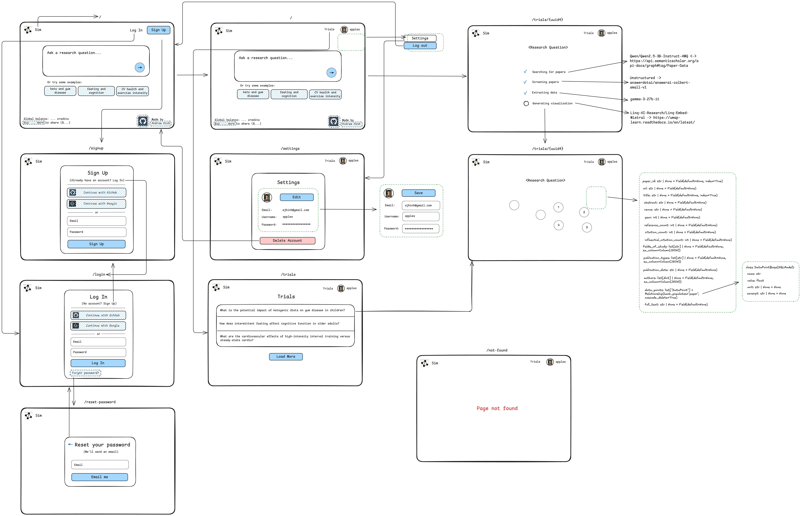

# sim

Directed interventional in-silico simulations



## Development

### Set Up

Set up the environment:

```bash
make setup
```

Create a `.env` (+ `.env.dev` + `.env.local`):

```bash
HF_TOKEN=

DATABASE_URL=
DOMAIN=

GITHUB_CLIENT_ID=
GITHUB_CLIENT_SECRET=
GOOGLE_CLIENT_ID=
GOOGLE_CLIENT_SECRET=

STRIPE_PUBLISHABLE_KEY=
STRIPE_SECRET_KEY=
STRIPE_WEBHOOK_SECRET=

EMAIL_SENDER=
SMTP_SERVER=
SMTP_PORT=
SMTP_USERNAME=
SMTP_PASSWORD=
```

### Useful Tips

Migrate db (do before running the frontend/api, env=local/dev/main):

```bash
make migrate MSG="your migration message" ENV=dev
```

### Repository Structure

```bash
.
├── .github                 # GitHub Actions.
├── db                      # database.
├── Python-Antivirus        # Python Antivirus.
├── src                     # frontend.
├── .pre-commit-config.yaml # pre-commit config.
├── Makefile                # Makefile.
├── pyproject.toml          # project deps.
├── README.md               # README.
├── uv.lock                 # project deps lock.
```

### Frontend

Serve the web app locally:

```bash
uv run src/app.py
stripe listen --forward-to <url>/webhook
```

Serve the web app on Modal:

```bash
modal serve src/app.py
stripe listen --forward-to <url>/webhook
```

Deploy on dev:

```bash
modal deploy src/app.py
```

Deploy on main:

```bash
modal deploy --env=main src/app.py
```
